# OVO_project

The point of this project is to optimize **INR (implicit neural representation) for brain scans**. Indeed, the point is to “compress less” zones where the tumor is detected (tanks to a CNN pretrained model) so that the **Dice score** is optimized.
We start with the database used in the article, from the [**Medical Segmentation Decathlon**.](https://drive.google.com/drive/folders/1HqEgzS8BV2c7xYNrZdEAnrHk7osJJ--2), the task01, which is a 7GO tar file with 500 train 3D brain scans (with their tumor masks) and 200 test 3D brain scans. I used google drive to store them, and colab to compute my model.

As it was done in the article, I was interested in **2D scans of brains** instead of 3D scans. 
Thus, I created new folders, storing only the middle part of each of the 3D scans, in the middle of the brain, where the 2D scan of the brain is the larger. This code create_2D_database.py is the one responsible for doing that task.
Here is an example of the database with the scan and the mask:

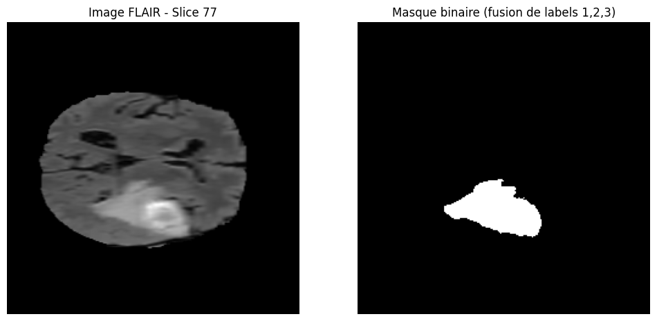

Then, I decided to train a U-Net model over the 500 labeled scans from the trained database. I am using, as it was done in the article, a UNet model, with the same loss (Binary Cross Entropy Loss) and the same optimizer (Adam, with lr = 1e-4) with the same number of epochs, 75. However, **I increased the batch size to train the model** faster since the GPU I had thanks to google colab had a better VRAM (15 GO) than the GPU used in the article (NVIDIA GeForce RTX 1080Ti GPU, with 11GO). After training, the model was stored here /content/drive/MyDrive/OVO_project/unet_brats.pth (in my drive)
The python code responsible for training this CNN is train_and_save_CNN.py.
To see if the CNN model trained well, I did this code infer_train.py, comparing the CNN mask to the real one. To infer the code over the test database and check if the CNN did not overfit, I did this code infer_test.py. 

Here is an example on the training dataset:

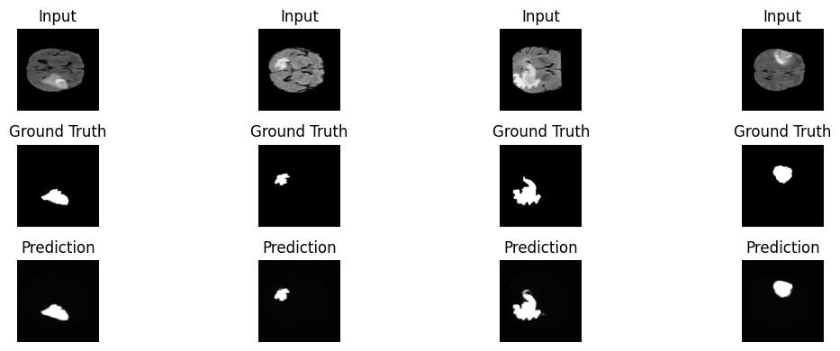

Here is and example on the test dataset:

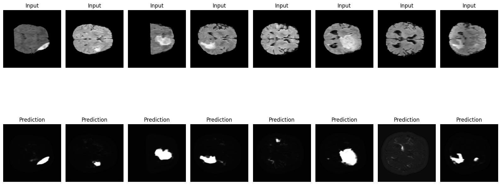

After that step, the goal was to create the beginning of the pipeline, an INR model. I **chose the SIREN one** as it was the easiest to implement. This code solo_SIREN_train_infer.py stores the image which is the output of the SIREN model. 

Here is an example:

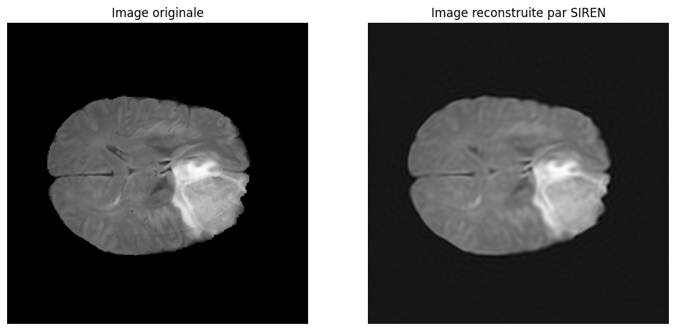

This model was the model I was looking to use with a lambda = 0. SINCO_pipeline.py trains with the same parameters of the article the new model, with the SIREN model penalized with a regularization term being the Dice score of the CNN over the output compressed, compared to the real mask. However, the main difference with the article was **the choice of the lambda parameter**. In the article lambda = 1 makes the output of the SINCO model  images still close to the images non penalized (with lambda = 0). I didn’t figure out why, since I took care of taking the same parameters of the article, but it was not my case. I then had to choose the best value for this hyperparameter. That’s why I plot the Dice score, the PSNR and SSIM score vs for different lambda values, to choose the parameter that offers the best compromise “likeness vs regularization”. This code SSIM_PSNR_Dice_vs_lambda.py is the one doing that part. I could not do it for a lot of images since each inference of the SINCO model was taking more than 40 minutes (adding the inference of the CNN at each epoch makes the SINCE model much slower to run compared to the simple SIREN one). From what I tested on the first scan (below) **a lambda of 1e-5** offers the best compromise:

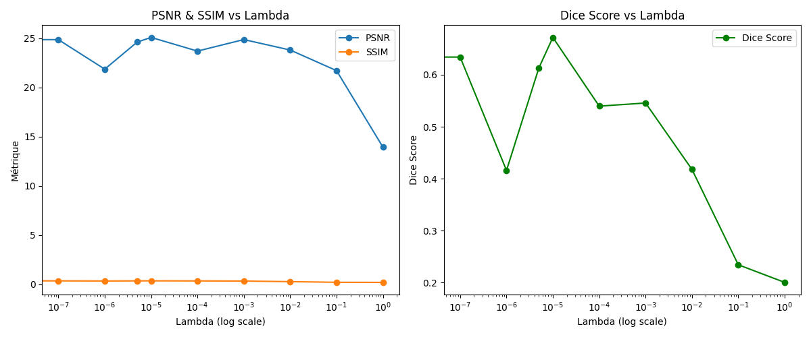

The SINCO model is implamebted in the SINCO_pipeline.py code, calling the U-Net model at each epoch to regularize the optimization.
As in the paper, the SINCO pipeline produces better result over this metrics than SIREN alone, as it is shown below:

### Image 395

| SIREN | SINCO |
|-------|-------|
| 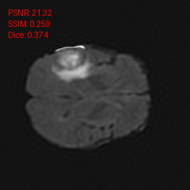 | 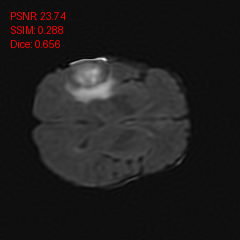 |

### Image 293

| SIREN | SINCO |
|-------|-------|
| 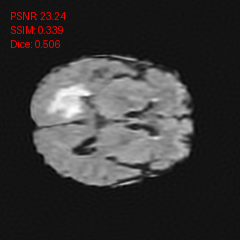 |  |

### Image 001

| SIREN | SINCO |
|-------|-------|
| 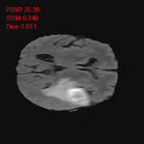 |  |

### Image 002

| SIREN | SINCO |
|-------|-------|
|  | 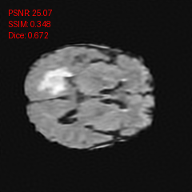 |

But sometimes, the resulst is not much better, or even a bit worse compared to SIREN. It is a limit not shown in the paper because it is testing different images.

### Image 271

| SIREN | SINCO |
|-------|-------|
| 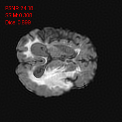 |  |

### Image 465

| SIREN | SINCO |
|-------|-------|
| 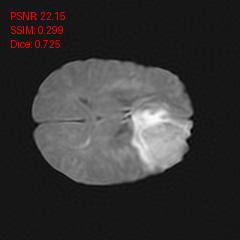 | 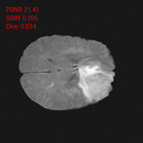 |

Unfortunately, I could not test over more images since the inference time was long. But it was still really interesting and I think it is a great improvement to SIREN.
